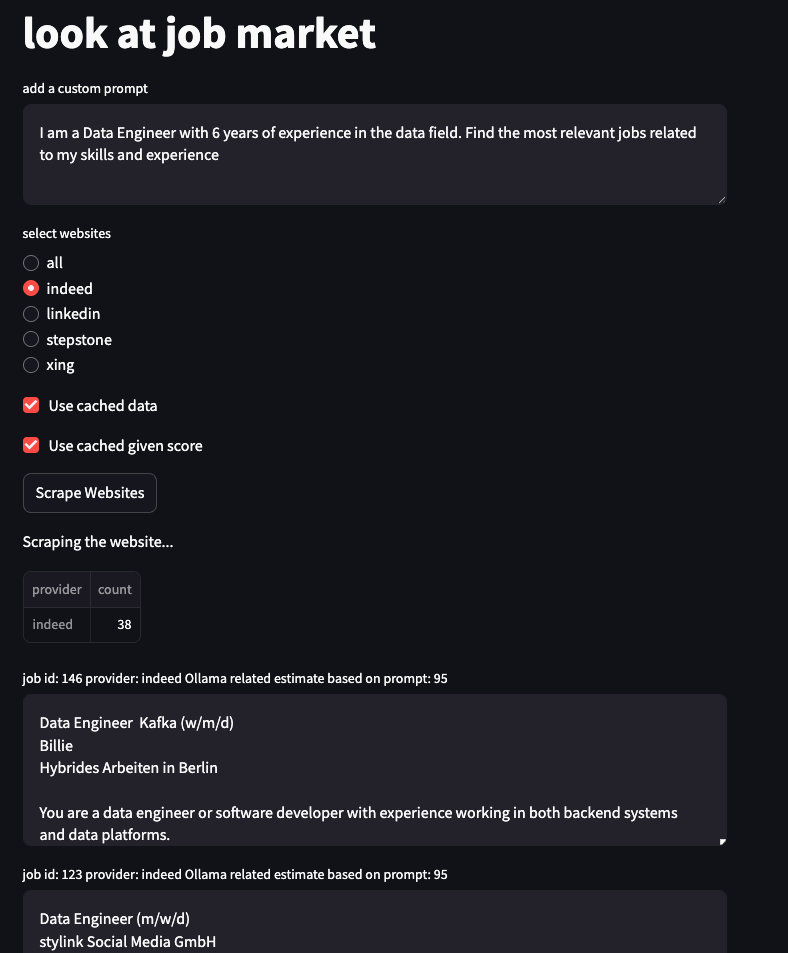

## Project Summary
This project involves scraping job listings from Indeed, Xing, and Stepstone, leveraging an LLM model to analyze them based on my skills and experience. The best-matching jobs will then be recommended


## run
```bash
streamlit run main.py
```

### requirement
- phi4:latest
- ollama3.2
- 


## screenshots
